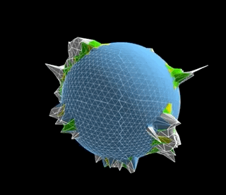

## planet generator

__Author__: Andrew Huynh

__License__: MIT

### a little history

Back when I was a wee lad, around the years of 2008-2009, I wanted to
experiment/play around with WebGL, which at the time was a relatively new
piece of technology. This code stemmed from the initial attempt and,
unfortunately, due to time constraints I could not pursue the project any
further than what I have here.

The planet generation code is based off of an even older school project
intended to build a complex 3D scene in OpenGL. For kicks, you can check
out the class project page here: [CSE167 Final Projects][cse169] and a
small write-up I did afterwards here:
[CSE167 Final Project Results][cse169results]

### about this repo

This repository contains WebGL & C++ code that setups and generates a
"planet" model. This is accomplished using the well known
[Particle Deposition][pdepo] technique. If you want to dive directly into
how the planet is generated, check the `generate` function in the file
`planet.js`.

If you're curious about how to interact with WebGL at a low level rather
than save time and use a nice library like [Three.js][3js], check out the
`gl*.js` files for a fun time.

All code is MIT licensed, so go ahead and use it in your next great game or
3D visualization tool!

[3js]: http://threejs.org/
[cse169]: http://graphics.ucsd.edu/twiki/bin/view.pl/Classes/CSE167F09-FinalProjects "CSE 167 Final Projects"
[cse169results]: http://a5huynh.github.io/2009/12/12/cse-167-final-project-results.html "CSE 167 Results"
[pdepo]: https://web.archive.org/web/20160307062357/http://www.lighthouse3d.com/opengl/terrain/index.php3?particle "Particle Deposition"

### typescript updates (2017)

In the year 2017, I decided to revisit portions of the planet generation code and
complete some updates I've been meaning to do for several years. You can check out
the code under the [`src/typescript`](src/typescript) directory and if you're interested in reading
a walkthrough of my thoughts and explanations feel free to check out the following:

- [Planet Rendering Pt. 1][blog-post-1]
- [Planet Rendering Pt. 2][blog-post-2]

[blog-post-1]: https://a5huynh.github.io/posts/2017/tbt-planet-rendering/ "TBT: Planet Rendering"
[blog-post-2]: https://a5huynh.github.io/posts/2017/planet-rendering-pt-2/ "Planet Rendering Pt. 2"
